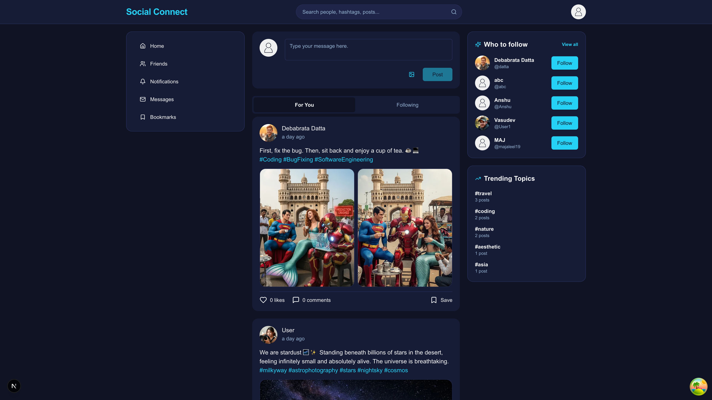
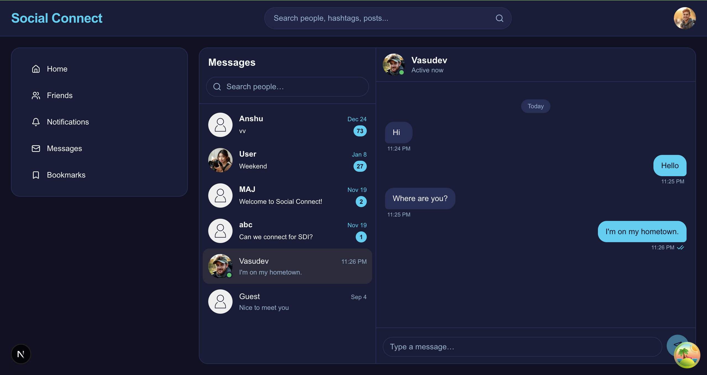
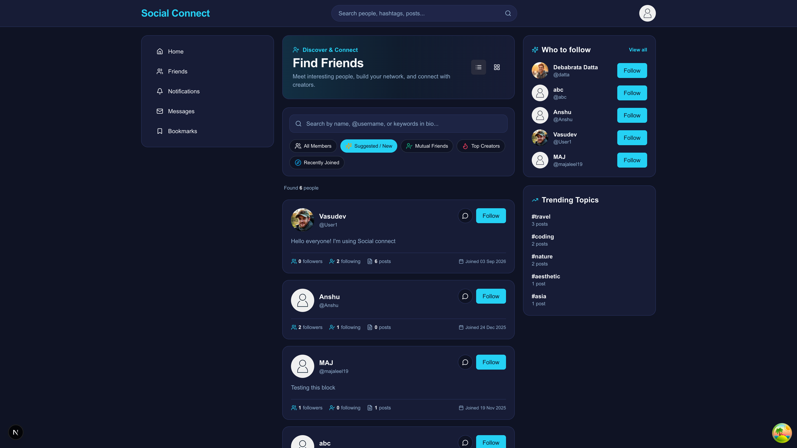
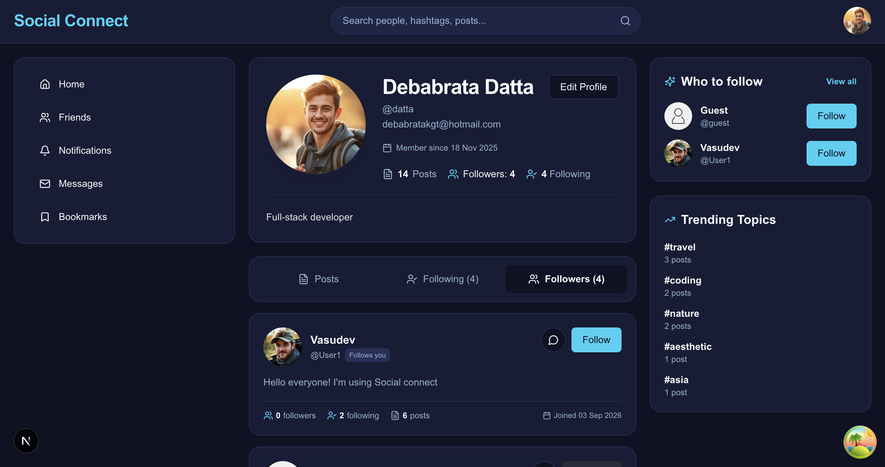
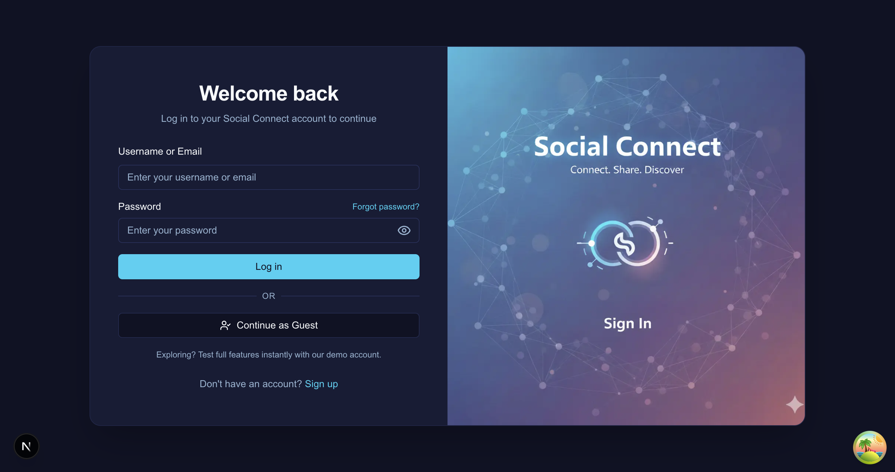
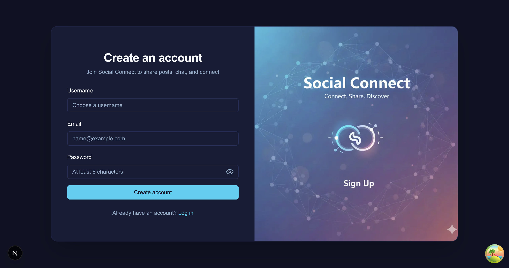

# Social Connect

A modern social media application built with Next.js, inspired by platforms like X (formerly Twitter). Share posts, connect with friends, engage in real-time conversations, and explore trending topics.

## Features

- **User Authentication**: Sign up and sign in with secure JWT-based sessions
- **Posts & Interactions**: Create, like, comment on posts, and bookmark favorites
- **Social Networking**: Follow/unfollow users, view follower/following counts
- **Real-time Messaging**: Direct messaging with typing indicators using Socket.io
- **Notifications**: Stay updated with activity notifications (likes, comments, follows)
- **Search & Explore**: Search for users and posts, explore trending topics
- **Media Uploads**: Upload and manage images with Cloudinary integration
- **Responsive Design**: Modern UI with dark/light theme support
- **Microservices Architecture**: Separate chat service for scalable real-time features

## 📸 Screenshots

Here is a quick look at the core features of the application:

<details>
<summary><b>Click to view screenshots</b></summary>

### Home & Feed



### Messaging



### Find Friends



### User Profile



### Authentication (Login / Signup)




</details>

## Tech Stack

### Frontend

- **Next.js 15** - React framework with Server Components
- **React Query (TanStack)** - Data fetching and caching
- **Tailwind CSS** - Utility-first CSS framework
- **ShadCN(Radix UI)** - Accessible component primitives
- **Socket.io Client** - Real-time communication

### Backend

- **Next.js API Routes** - REST API endpoints
- **Prisma ORM** - Database modeling and queries
- **PostgreSQL** - Primary database (via Docker)
- **JWT** - Authentication tokens

### Microservices

- **Chat Service** - Node.js/Express with Socket.io for real-time messaging
- **TypeScript** - Type-safe development across all services

### DevOps & Tools

- **Docker & Docker Compose** - Containerization and local database
- **Makefile** - Development commands and automation
- **ESLint** - Code linting
- **Prettier** - Code formatting
- **Husky + lint-staged** - Pre-commit hooks for automated code quality checks
- **Yarn** - Package management

## Architecture

The application follows a microservices architecture:

- **Main App** (Next.js): Handles posts, users, authentication, UI
- **Chat Service** (Node.js + Socket.io): Dedicated service for real-time messaging and notifications

```
┌─────────────────┐    ┌─────────────────┐
│   Next.js App   │    │  Chat Service   │
│   (Port 3000)   │◄──►│   (Port 3001)  │
│                 │    │                 │
│ • Posts API     │    │ • WebSocket     │
│ • User API      │    │ • Messaging     │
│ • Auth API      │    │ • Typing        │
└─────────────────┘    └─────────────────┘
         │                       │
         └───────────────────────┘
                PostgreSQL
               (Port 5432)
```

## Prerequisites

- Node.js 18+ and Yarn
- Docker and Docker Compose (for local database)
- PostgreSQL knowledge (basic)

## Installation

1. **Clone the repository**

   ```bash
   git clone https://github.com/ImDebabrata/social-connect-next.git
   cd social-connect-next
   ```

2. **Install dependencies**

   ```bash
   make install
   # or manually: yarn install
   ```

3. **Set up environment variables**

   Create your environment files from the template:

   ```bash
   cp .env.example .env.dev   # for development
   cp .env.example .env.prod  # for production
   # Edit each file with the appropriate values
   ```

   Required environment variables (see `.env.example`):

   ```env
   # Application URLs
   NEXT_PUBLIC_API_URL="http://localhost:3000"
   NEXT_PUBLIC_CHAT_SERVICE_URL="http://localhost:3001"

   # Database (Either local Docker or remote Postgres like Neon)
   POSTGRES_PRISMA_URL="your-postgres-connection-string"

   # JWT Secret for authentication
   JWT_SECRET="your-jwt-secret"

   # Cloudinary (for media uploads)
   CLOUDINARY_CLOUD_NAME="your-cloudinary-cloud-name"
   CLOUDINARY_API_KEY="your-cloudinary-api-key"
   CLOUDINARY_API_SECRET="your-cloudinary-api-secret"
   ```

## Running the Application

### Quick Start (Recommended)

Use the Makefile to start all services:

```bash
make start-all
```

This will:

- Start PostgreSQL in Docker
- Run the chat service in the background
- Start the Next.js development server

### Manual Start

If you prefer to run services manually:

1. **Start the database**

   ```bash
   docker compose up -d
   ```

2. **Set up the database**

   ```bash
   make prisma-push
   # or: npx prisma db push
   ```

3. **Start the chat service**

   ```bash
   cd chat-service && yarn dev       # dev environment
   cd chat-service && yarn dev:prod  # production environment
   ```

4. **Start the main application**
   ```bash
   yarn dev        # dev environment
   yarn dev:prod   # production environment
   ```

### Access the Application

- **Main App**: [http://localhost:3000](http://localhost:3000)
- **Chat Service**: [http://localhost:3001](http://localhost:3001) (API status)

## Available Commands

```bash
# ── Dependencies ──
make install          # Install main app dependencies
make install-chat     # Install chat-service dependencies
make install-all      # Install all dependencies

# ── Development ──
make dev              # Next.js dev server (dev env)
make dev-prod         # Next.js dev server (prod env)
make dev-chat         # Chat service dev (dev env)
make dev-chat-prod    # Chat service dev (prod env)
make start-all        # Start everything: DB + chat + app (dev)
make start-all-prod   # Start everything: DB + chat + app (prod)

# ── Build & Production ──
make build            # Build (current .env)
make build-dev        # Build with dev env
make build-prod       # Build with prod env
make build-chat       # Build chat-service (tsc)
make start            # Start production Next.js server

# ── Code Quality ──
make lint             # Run ESLint
make format           # Format code with Prettier
make format-check     # Check formatting (CI)

# ── Database ──
make prisma           # Generate Prisma client
make prisma-push      # Push schema to database
make prisma-table     # Open Prisma Studio

# ── Docker ──
make docker-run       # Start Docker containers

# ── Cleanup ──
make clean            # Remove .next build artifacts
make clean-chat       # Remove chat-service/dist
make clean-all        # Remove all build artifacts
```

## Development

### Project Structure

```
social-connect/
├── src/
│   ├── app/                 # Next.js app directory
│   │   ├── (app)/           # Protected routes
│   │   ├── (auth)/          # Auth routes
│   │   └── api/             # API routes
│   ├── components/          # Reusable components
│   ├── lib/                 # Utilities and configurations
│   └── hooks/               # Custom React hooks
├── chat-service/            # Real-time chat microservice
│   ├── src/
│   │   ├── socket/          # Socket.io handlers
│   │   └── index.ts         # Express server
├── prisma/                  # Database schema
├── public/                  # Static assets
├── .prettierrc              # Prettier configuration
├── .prettierignore          # Prettier ignore rules
├── .husky/                  # Git hooks (pre-commit)
└── compose.yaml             # Local database setup (Docker)
```

## License

This project is licensed under the MIT License - see the [LICENSE](LICENSE) file for details.

## Acknowledgments

- Inspired by social media platforms like X (Twitter)
